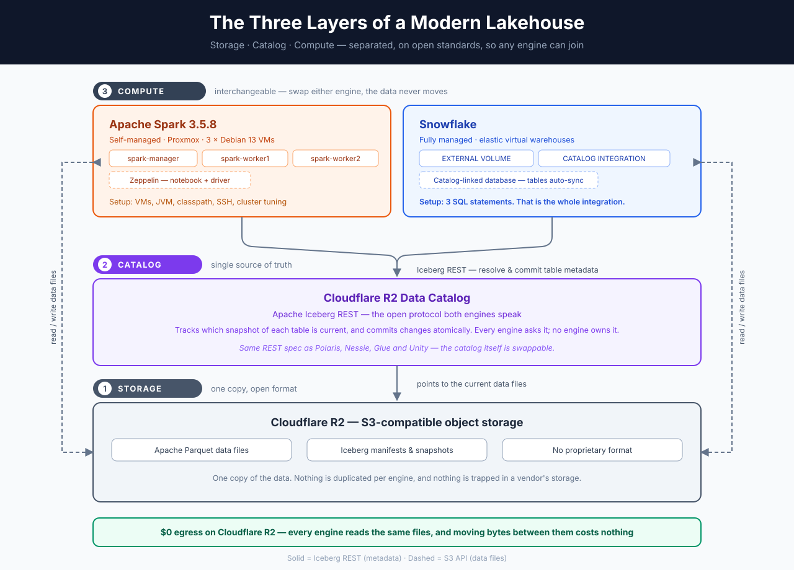

# Open Lakehouse — Storage, Catalog and Compute, Cleanly Separated

A working reference for modern three-layer data architecture: **Apache Iceberg**
tables on **Cloudflare R2**, registered in an **Iceberg REST catalog**, and
queried and written by two completely independent compute engines — a
self-managed **Apache Spark** cluster and **Snowflake**.

One copy of the data. One catalog. No pipeline moving data between engines.

This repository is the configuration and the reasoning behind it — a reference
if you want to build the same thing.



---

## The idea in one paragraph

A traditional warehouse bundles storage, metadata and compute into one product.
That's convenient, and it's also why migrating off one is a project rather than
a decision. A lakehouse pulls those three apart and connects them with open
standards instead: files in an open format, a catalog with a published protocol,
and compute that is free to be anything that speaks both. Once they're
separated, adding an engine is a configuration change — and so is removing one.

---

## Layer 1 — Storage

**Cloudflare R2**, S3-compatible object storage, holding Apache Parquet data
files and Iceberg metadata.

Storage knows nothing about tables. It's a bucket. Everything above it is open
format, so the data is readable by anything that reads Parquet — today, and in
ten years, with or without the engines that wrote it.

R2 in particular charges **no egress**. That matters more than it first appears
in a multi-engine design: every engine reads the full data files from object
storage, so on egress-billed storage, each additional engine adds transfer cost,
and consolidating onto a single vendor's compute quietly becomes the cheapest
option. With zero egress, the architecture and the bill point the same way.

## Layer 2 — Catalog

**Cloudflare R2 Data Catalog**, an implementation of the **Apache Iceberg REST
catalog** spec.

This is the layer people skip, and it's the one that makes the rest work. The
catalog answers one question: *for table X, which snapshot is current?* It maps
a table name to the current `metadata.json` pointer and swaps that pointer
atomically on commit.

That single responsibility is what allows two engines to share a table safely.
Neither engine holds table state, so neither engine owns the table — they both
ask the catalog. And because the REST protocol is a published spec implemented
by Polaris, Nessie, Lakekeeper, Unity and Glue, the catalog is itself
replaceable: you re-point a URI, you don't rewrite metadata.

## Layer 3 — Compute

Two engines, deliberately chosen from opposite ends of the build-vs-buy axis:

**Apache Spark 3.5.8**, self-managed — three Debian 13 VMs on Proxmox
(`spark-manager`, `spark-worker1`, `spark-worker2`) with Zeppelin on a fourth
acting as notebook and driver.

**Snowflake**, fully managed — elastic virtual warehouses.

Neither stores table state. Either can be stopped, rebuilt or swapped out
without touching a byte of data.

---

## What surprised me: the integration effort is wildly asymmetric

Standing up the Spark side is real infrastructure work — provisioning VMs,
matching Java and Scala versions, getting the Iceberg runtime and AWS bundle
onto the classpath, hostname resolution, passwordless SSH, worker resource
tuning. Worth doing once, because you learn how every piece fits.

Connecting Snowflake to the *same tables* is three SQL statements:

```sql
CREATE EXTERNAL VOLUME   ...   -- how to reach the R2 bucket
CREATE CATALOG INTEGRATION ... -- how to reach the Iceberg REST catalog
CREATE DATABASE ... LINKED_CATALOG = ( ... )  -- sync the namespaces
```

That's the whole integration. No connector, no ingest job, no copy of the data.
Tables that Spark created appear in Snowflake on their own, and Snowflake can
run DML straight against them.

Both engines are doing the same amount of *work* — the difference is entirely in
how much of it you operate yourself. Seeing that contrast side by side, against
one shared set of tables, is the clearest illustration of the three-layer model
I've found.

---

## The stack

| Layer | Choice | Where it runs |
|---|---|---|
| Storage | Cloudflare R2 | Cloudflare |
| Table format | Apache Iceberg 1.11.0 | — |
| Catalog | R2 Data Catalog (Iceberg REST) | Cloudflare |
| Compute A | Apache Spark 3.5.8, standalone | 3 × Debian 13 VMs on Proxmox |
| Notebook / driver | Apache Zeppelin | 1 × Debian VM on Proxmox |
| Compute B | Snowflake virtual warehouse | Snowflake |

---

## Repository layout

```
.
├── docs/
│   ├── architecture.svg / .png     Diagram
│   ├── architecture.md             How a query flows through the layers
│   └── setup-guide.md              Build it yourself, step by step
├── spark/conf/
│   ├── spark-defaults.conf         Iceberg + R2 REST catalog — the core file
│   ├── spark-env.sh                Master
│   ├── spark-env.worker.sh         Workers
│   └── workers                     Cluster membership
├── zeppelin/conf/
│   └── zeppelin-env.sh             Notebook host, doubles as Spark driver
├── snowflake/
│   ├── 01-external-volume.sql      Storage access
│   ├── 02-catalog-integration.sql  Catalog access
│   └── 03-linked-database.sql      Namespace auto-sync
├── sql/
│   ├── ddl/                        Table creation
│   └── dml/                        Cross-engine reads and writes
└── .env.example                    Every value you need to supply
```

Secrets are `${PLACEHOLDERS}` throughout — copy `.env.example` to `.env` and
substitute. Full walkthrough in [docs/setup-guide.md](docs/setup-guide.md).

---

## Seeing it work

Run these in order, switching engines where marked:

| Step | File | Engine |
|---|---|---|
| 1 | [`sql/ddl/01-spark-create-tables.sql`](sql/ddl/01-spark-create-tables.sql) | Spark |
| 2 | [`sql/dml/02-spark-write.sql`](sql/dml/02-spark-write.sql) | Spark |
| 3 | [`sql/dml/03-snowflake-read-write.sql`](sql/dml/03-snowflake-read-write.sql) | Snowflake |
| 4 | [`sql/dml/04-spark-verify.sql`](sql/dml/04-spark-verify.sql) | Spark |

Step 4 is the satisfying one: Spark sees the rows Snowflake inserted, and the
table's snapshot history interleaves commits from both engines — with no ingest
step anywhere between them.

---

## Three things that will save you an hour

**Match the Iceberg runtime to your exact Spark and Scala build.**
`iceberg-spark-runtime-3.5_2.12` for Spark 3.5.x on Scala 2.12. A mismatch
doesn't warn you about versions — the catalog just fails to resolve.

**`S3FileIO` reads catalog-scoped `s3.*` properties, not Hadoop's `fs.s3a.*`.**
Set `spark.sql.catalog.<name>.s3.endpoint`, `.s3.access-key-id`,
`.s3.secret-access-key`, `.s3.path-style-access`. With only the `s3a` settings,
`SHOW TABLES` and `DESCRIBE` work fine — that's all catalog traffic — and things
only break when a query opens a data file.

**R2 issues static API tokens; it doesn't implement the OAuth2 exchange
Iceberg's REST client tries by default.** Turn the flow off and pass the header
directly:

```properties
spark.sql.catalog.r2.rest.auth.type         none
spark.sql.catalog.r2.header.Authorization   Bearer ${R2_CATALOG_TOKEN}
```

---

## Scope

This is a homelab build for learning and demonstrating the three-layer model.
It's complete and it works end to end, but it's sized for understanding rather
than production — no maintenance scheduling, and credentials are static.

## What's next

- Scheduled compaction and snapshot expiry
- dbt over these tables for bronze/silver/gold modelling
- A third engine — DuckDB or Trino — on the same catalog

## License

MIT
